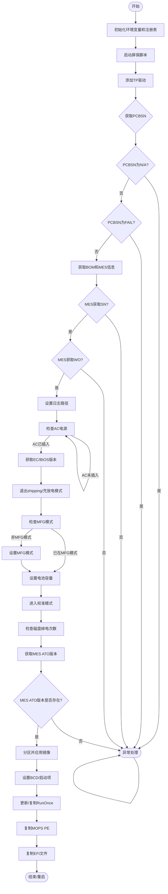

```mermaid
flowchart TD
    Start([开始])
    Init[初始化环境变量和注册表]
    StartScreenProtect[启动屏保脚本]
    AddTPDriver[添加TP驱动]
    GetPCBSN{获取PCBSN}
    PCBSN_NA{PCBSN为N/A?}
    PCBSN_FAIL{PCBSN为FAIL?}
    GetBOM[获取BOM和MES信息]
    MES_SN{MES获取SN?}
    MES_WO{MES获取WO?}
    SetLogPath[设置日志路径]
    CheckACIN[检查AC电源]
    GetEC[获取EC/BIOS版本]
    LIDCLOSE[退出shipping/充放电模式]
    CheckMFG[检查MFG模式]
    SetToMFG[设置MFG模式]
    SetTarget[设置电池容量]
    EnterCalibration[进入校准模式]
    DiskUnsafe[检查磁盘掉电次数]
    GetATOVer[获取MES ATO版本]
    DLATO{MES ATO版本是否存在?}
    PartitionDisk[分区并应用镜像]
    SetBCD[设置BCD/启动项]
    Update[更新/复制RunOnce]
    MOPSPE[复制MOPS PE]
    CopyEFI[复制EFI文件]
    End([结束/重启])
    Error([异常处理])

    Start --> Init --> StartScreenProtect --> AddTPDriver
    AddTPDriver --> GetPCBSN
    GetPCBSN --> PCBSN_NA
    PCBSN_NA -- 是 --> Error
    PCBSN_NA -- 否 --> PCBSN_FAIL
    PCBSN_FAIL -- 是 --> Error
    PCBSN_FAIL -- 否 --> GetBOM
    GetBOM --> MES_SN
    MES_SN -- 否 --> Error
    MES_SN -- 是 --> MES_WO
    MES_WO -- 否 --> Error
    MES_WO -- 是 --> SetLogPath
    SetLogPath --> CheckACIN
    CheckACIN -- AC未插入 --> CheckACIN
    CheckACIN -- AC已插入 --> GetEC
    GetEC --> LIDCLOSE --> CheckMFG
    CheckMFG -- 非MFG模式 --> SetToMFG
    CheckMFG -- 已在MFG模式 --> SetTarget
    SetToMFG --> SetTarget
    SetTarget --> EnterCalibration
    EnterCalibration --> DiskUnsafe
    DiskUnsafe --> GetATOVer
    GetATOVer --> DLATO
    DLATO -- 否 --> Error
    DLATO -- 是 --> PartitionDisk
    PartitionDisk --> SetBCD --> Update --> MOPSPE --> CopyEFI --> End
    Error --> Error
```