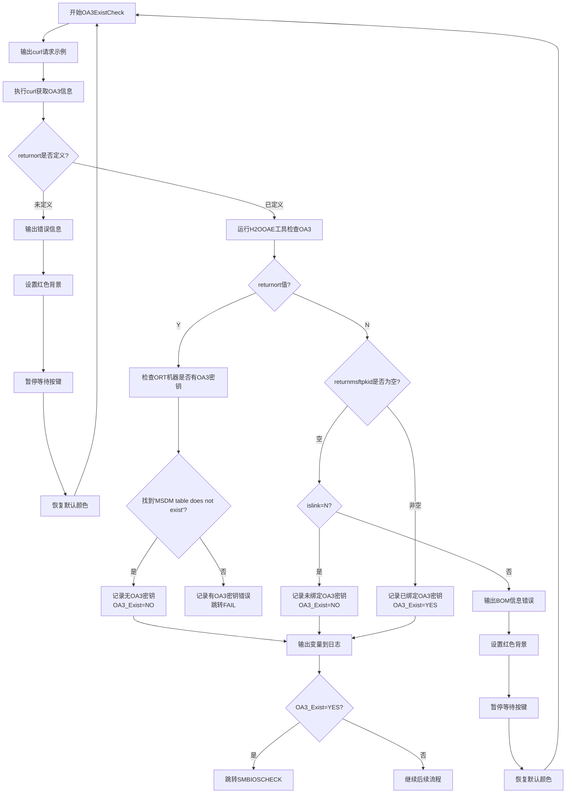

```mermaid
flowchart TD
    A[开始OA3ExistCheck] --> B[输出curl请求示例]
    B --> C[执行curl获取OA3信息]
    C --> D{returnort是否定义?}
    D -- 未定义 --> E[输出错误信息]
    E --> F[设置红色背景]
    F --> G[暂停等待按键]
    G --> H[恢复默认颜色]
    H --> A
    D -- 已定义 --> I[运行H2OOAE工具检查OA3]
    I --> J{returnort值?}
    J -- Y --> K[检查ORT机器是否有OA3密钥]
    K --> L{找到'MSDM table does not exist'?}
    L -- 是 --> M[记录无OA3密钥\nOA3_Exist=NO]
    L -- 否 --> N[记录有OA3密钥错误\n跳转FAIL]
    J -- N --> O{returnmsftpkid是否为空?}
    O -- 空 --> P{islink=N?}
    P -- 是 --> Q[记录未绑定OA3密钥\nOA3_Exist=NO]
    P -- 否 --> R[输出BOM信息错误]
    R --> S[设置红色背景]
    S --> T[暂停等待按键]
    T --> U[恢复默认颜色]
    U --> A
    O -- 非空 --> V[记录已绑定OA3密钥\nOA3_Exist=YES]
    M --> W[输出变量到日志]
    Q --> W
    V --> W
    W --> X{OA3_Exist=YES?}
    X -- 是 --> Y[跳转SMBIOSCHECK]
    X -- 否 --> Z[继续后续流程]
```
