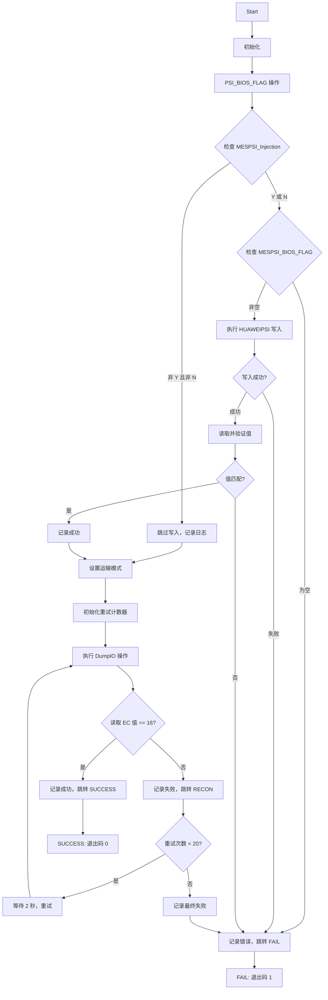
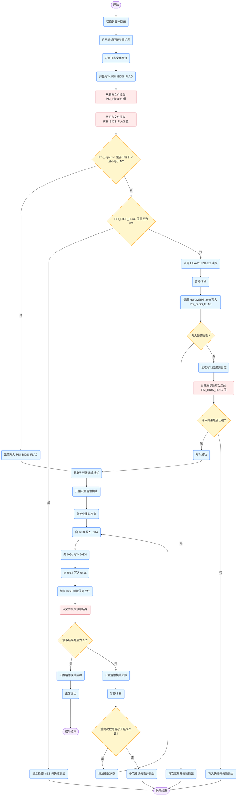

```mermaid
flowchart TD
    A[Start] --> B[初始化]
    B --> C[PSI_BIOS_FLAG 操作]
    C --> D{检查 MESPSI_Injection}
    D -->|非 Y 且非 N| E[跳过写入，记录日志]
    D -->|Y 或 N| F{检查 MESPSI_BIOS_FLAG}
    F -->|为空| G[记录错误，跳转 FAIL]
    F -->|非空| H[执行 HUAWEIPSI 写入]
    H --> I{写入成功?}
    I -->|失败| G
    I -->|成功| J[读取并验证值]
    J --> K{值匹配?}
    K -->|是| L[记录成功]
    K -->|否| G
    E --> M[设置运输模式]
    L --> M
    M --> N[初始化重试计数器]
    N --> O[执行 DumpIO 操作]
    O --> P{读取 EC 值 == 16?}
    P -->|是| Q[记录成功，跳转 SUCCESS]
    P -->|否| R[记录失败，跳转 RECON]
    R --> S{重试次数 < 20?}
    S -->|是| T[等待 2 秒，重试]
    T --> O
    S -->|否| U[记录最终失败]
    U --> G
    Q --> V[SUCCESS: 退出码 0]
    G --> W[FAIL: 退出码 1]
```

```mermaid
graph TD
    classDef startend fill:#F5EBFF,stroke:#BE8FED,stroke-width:2px;
    classDef process fill:#E5F6FF,stroke:#73A6FF,stroke-width:2px;
    classDef decision fill:#FFF6CC,stroke:#FFBC52,stroke-width:2px;
    classDef io fill:#FFEBEB,stroke:#E68994,stroke-width:2px;
    
    A([开始]):::startend --> B(切换到脚本目录):::process
    B --> C(启用延迟环境变量扩展):::process
    C --> D(设置日志文件路径):::process
    D --> E(开始写入 PSI_BIOS_FLAG):::process
    E --> F(从日志文件提取 PSI_Injection 值):::io
    F --> G(从日志文件提取 PSI_BIOS_FLAG 值):::io
    G --> H{PSI_Injection 是否不等于 Y 且不等于 N?}:::decision
    H -- 是 --> I(无需写入 PSI_BIOS_FLAG):::process
    I --> J(跳转到设置运输模式):::process
    H -- 否 --> K{PSI_BIOS_FLAG 值是否为空?}:::decision
    K -- 是 --> L(提示检查 MES 并失败退出):::process
    K -- 否 --> M(调用 HUAWEIPSI.exe 读取):::process
    M --> N(暂停 3 秒):::process
    N --> O(调用 HUAWEIPSI.exe 写入 PSI_BIOS_FLAG):::process
    O --> P{写入是否失败?}:::decision
    P -- 是 --> Q(再次读取并失败退出):::process
    P -- 否 --> R(读取写入结果到日志):::process
    R --> S(从日志提取写入后的 PSI_BIOS_FLAG 值):::io
    S --> T{写入结果是否正确?}:::decision
    T -- 是 --> U(写入成功):::process
    U --> J(跳转到设置运输模式):::process
    T -- 否 --> V(写入失败并失败退出):::process
    J --> W(开始设置运输模式):::process
    W --> X(初始化重试次数):::process
    X --> Y(向 0x68 写入 0x14):::process
    Y --> Z(向 0x6c 写入 0xD4):::process
    Z --> AA(向 0x68 写入 0x16):::process
    AA --> AB(读取 0x68 地址值到文件):::process
    AB --> AC(从文件提取读取结果):::io
    AC --> AD{读取结果是否为 16?}:::decision
    AD -- 是 --> AE(设置运输模式成功):::process
    AE --> AF(正常退出):::process
    AD -- 否 --> AG(设置运输模式失败):::process
    AG --> AH(暂停 2 秒):::process
    AH --> AI{重试次数是否小于最大次数?}:::decision
    AI -- 是 --> AJ(增加重试次数):::process
    AJ --> Y(向 0x68 写入 0x14):::process
    AI -- 否 --> AK(多次重试失败并退出):::process
    L --> AL([失败结束]):::startend
    Q --> AL
    V --> AL
    AK --> AL
    AF --> AM([成功结束]):::startend
```