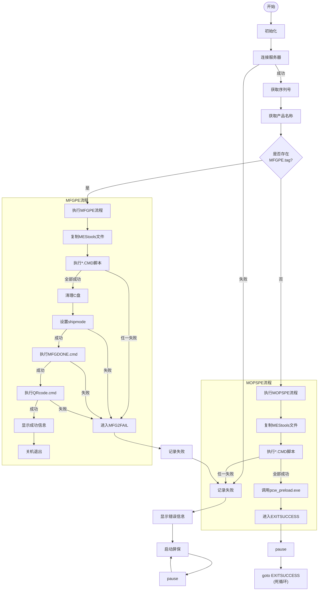

```mermaid
flowchart TD
    A([开始]) --> B[初始化]
    B --> C[连接服务器]
    C -->|成功| D[获取序列号]
    C -->|失败| E[记录失败]
    D --> F[获取产品名称]
    F --> G{是否存在\nMFGPE.tag?}
    G -->|否| H[执行MOPSPE流程]
    G -->|是| I[执行MFGPE流程]

    subgraph MOPSPE流程
        H --> H1[复制MEStools文件]
        H1 --> H2[执行*.CMD脚本]
        H2 -->|任一失败| E
        H2 -->|全部成功| H3[调用pcw_preload.exe]
        H3 --> J[进入EXITSUCCESS]
    end

    subgraph MFGPE流程
        I --> I1[复制MEStools文件]
        I1 --> I2[执行*.CMD脚本]
        I2 -->|任一失败| K[进入MFG2FAIL]
        I2 -->|全部成功| I3[清理C盘]
        I3 --> I4[设置shipmode]
        I4 -->|失败| K
        I4 -->|成功| I5[执行MFGDONE.cmd]
        I5 -->|失败| K
        I5 -->|成功| I6[执行QRcode.cmd]
        I6 -->|失败| K
        I6 -->|成功| M[显示成功信息]
        M --> N[关机退出]
    end

    J --> J1["pause"]
    J1 --> J2["goto EXITSUCCESS\n(死循环)"]

    K --> K1[记录失败]
    K1 --> E

    E --> E1[显示错误信息]
    E1 --> E2[启动屏保]
    E2 --> E3["pause"]
    E3 --> E2
```