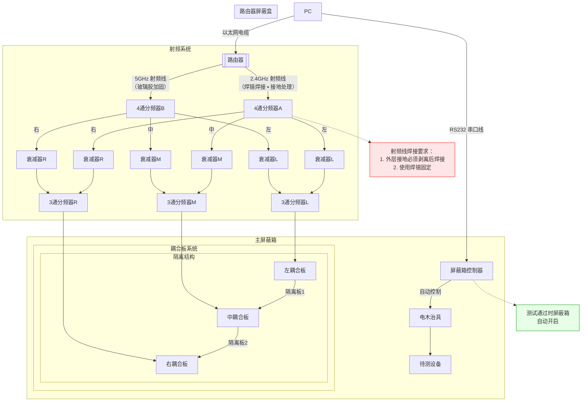

# 测试原理和调试方法

## 接线描述

1. 路由器2G天线接1根射频线到4通分频器A上，连接处需要用焊锡焊接（射频线焊接时，需要特别注意接地部分也需要焊接，接地在线的外围，需要剥离）
2. 路由器5G天线接1根射频线到4通分频器B上，连接处需要用玻璃胶加固
3. 4通分频器A接3跟线出来，分别代表左中右，分别连接3个衰减器
4. 4通分频器B接3跟线出来，分别代表左中右，分别连接3个衰减器
5. 将分频器A和B接出来的2根代表左边的线，透过3通分频器汇聚到1条射频线上，并连接治具中的左边的耦合板
6. 将分频器A和B接出来的2根代表中间的线，透过3通分频器汇聚到1条射频线上，并连接治具中的中间的耦合板
7. 将分频器A和B接出来的2根代表右边的线，透过3通分频器汇聚到1条射频线上，并连接治具中的右边的耦合板
8. 电脑透过网线连接路由器，并配置路由器的设定
9. 电脑透过串口线连接屏蔽箱，并透过厂商程式控制屏蔽箱，当测试pass时，屏蔽箱自动打开（具体原理还需要了解）
10. 屏蔽箱中放一个电木治具，待测设备可以放在此治具上，左中右耦合板卡在电木治具下面，并用2块隔离板隔开左中右耦合板
11. 路由器使用一个单独小屏蔽盒存放，放在屏蔽箱外面

## 接线图

## 天线位置
> |TAS|2g/5g|ANT1|天线位置|
> |--|--|--|--|
> |enable tas|2g|ant1|左|
> |enable tas|2g|ant2|中|
> |disable tas|2g|ant1|左|
> |disable tas|2g|ant2|右|
> |enable tas|5g|ant1|左|
> |enable tas|5g|ant2|中|
> |disable tas|5g|ant1|左|
> |disable tas|5g|ant2|右|

## Spec
> |sepc|上限|下限|
> |--|--|--|
> |5g|-40|-50|
> |2g|-24|-34|