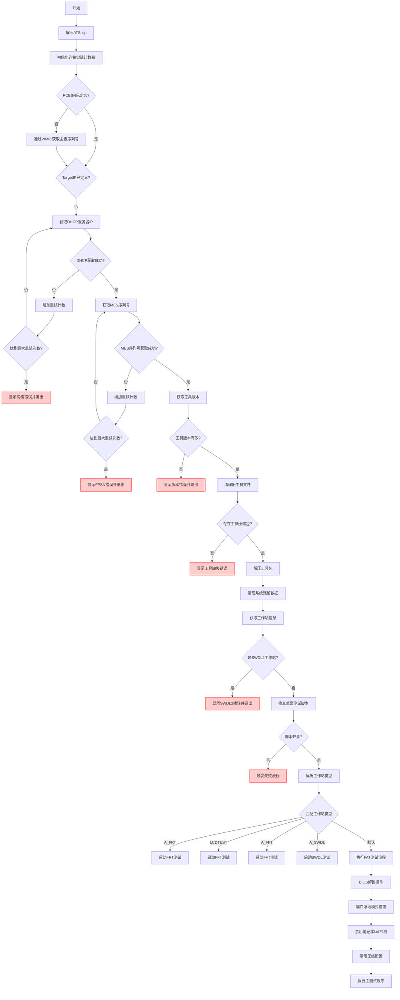

```batch
MESToPEC\MESToPEC.exe使用说明：

读取偏移量：0bh 来自 c:\windows\bootstat.dat 时：
WingTechMesToPE.exe "BOOTCHK"

上传文件时：
WingTechMesToPE.exe "UPLOAD" "strLocalFile" "strRemoteFile"

下载文件时：
WingTechMesToPE.exe "DOWNLOAD" "strLocalFile" "strRemoteFile"

与MES交互时：
WingTechMesToPE.exe "string1" "string2" "string3"

"string1": 指定MES方法名称：
    "WI1012" - 获取BtMac, WiFiMac, IMEI, PcbSN, UUID
    "WI1032" - 获取系统SN、T_Order和产线名称
    "WI101T" - 获取ATO/TOOLS/Preload版本、产品名称和硬件信息
    "WI601K" - 检查SN是否在SWDL2工作站
    "WI601_QC" - 1) 检查SN是否在SQC批次号中 2) 传递SQCReDLSuccessful结果给MES
    "OA3ProductKeyID" - 从MES获取OA3产品密钥ID
    "CheckOA3" - 询问MES该SN是否绑定OA3
    "GetOA3HashState" - 获取MES中的OA3硬件哈希状态（发送CBR前调用）
    "OA3HardHash" - 发送OA3硬件哈希到MES
    "HWPartition" - SWDL2验证预装分区
    "WI6049" - SWDL2自动通过状态，获取OBE信息
    "WI604A" - SWDL2自动通过状态，获取OBE信息
    "WI604B" - 与WI604A相同（Dirac特殊需求，增加oobModelCheck）
    "WI1061" - Dirac特殊需求检查是否需要FQC检测
    "WI603" - Dirac特殊需求发送IP信息到MES

"string2": 指定客户名称（如TM、HWBD、LENOVO或ASUS等）

"string3": 指定MES方法的输入参数：
    方法"WI1012"：输入系统SN
    方法"WI1032"：输入PCB SN
    方法"WI101T"：输入系统SN
    方法"WI601K"：输入系统SN
    方法"WI601_QC"：获取SQC状态时输入系统SN；传递DL2结果时输入SN SQCReDLSuccessful
    方法"OA3ProductKeyID"：输入系统SN
    方法"CheckOA3"：输入参数如：SN
    方法"GetOA3HashState"：输入参数如：SN OA3ProductKeyID
    方法"OA3HardHash"：输入参数如：SN hardhash
    方法"HWPartition"：输入从WI101T方法获取的productname
    方法"WI6049"：输入参数如：ProductName SN PSN WorkOrderNumber
    方法"WI604A"：输入参数如：ProductName SN PSN WorkOrderNumber LineName preloadstate preloaderrormessage
        （ProductName从WI101T获取，WorkOrderNumber从WI1032的T_Order获取，LineName从WI1032的LineName获取）
    方法"WI1061"：输入PCB SN
    方法"WI603"：输入sn, ip, preload_state(RUNNING/PASS/FAIL)
```

```batch
  ******************** WTIO.exe 版本：1.0.1.5 ************************

   01).  /w     写IO </w 0x00 0x00>
   02).  /r     读IO </r 0x00>
   03).  /pn    读写SMBIOS产品名称，字符串格式，最大长度64，</pn "产品名称字符串">
   04).  /pjn   读写SMBIOS项目名称，字符串格式，最大长度64，</pjn "项目名称字符串">
   05).  /ln    读写联想序列号，字符串格式，最大长度32，</ln "序列号">
   06).  /uu    读写SMBIOS UUID，十六进制格式，最大长度32，</uu "十六进制字符串">
   07).  /kd    读写键盘ID，字符串格式，最大长度1，</kd "(S/U/J/B)"> (S: 美式 U: 英式, J: 日式, B: 巴西葡萄牙语)
   08).  /bt    读写品牌类型，字符串格式，最大长度1，</bt "C/T"> (C: 联想消费笔记本, T: 都灵笔记本)
   09).  /el    读写EPA ID，十六进制格式，最大长度2，</el 0~FF> (0:显示EPA徽标，AA:隐藏EPA徽标)
   10).  /fl    读写功能标志
   11).  /cd    读写客户ID，十六进制格式，最大长度2，</cd "ID">
   12).  /cf    读写配置标志，十六进制格式，最大长度16，</cf "XXXXXXXXXXXXXXXX">
   13).  /at    读写资产标签，字符串格式，最大长度16，</at "资产标签名称">
   14).  /osp   读写OS PN号，字符串格式，最大长度16，</osp "PN号">
   15).  /oss   读写OS描述符，字符串格式，最大长度32，</oss "描述符">
   16).  /oa3   读写OA3密钥，十六进制格式，最大长度64，</oa3 "数据">
   17).  /mt    读写MTM号，字符串格式，最大长度64，</mt "编号">
   18).  /fd    读写系列名称，字符串格式，最大长度64，</fd "系列名称">
   19).  /sg    读写签名，字符串格式，最大长度4，</sg "XXXX">
   20).  /ubp   读写UEFI启动优先级，整数格式，</ubp "0: SSD; 1: PXE, 2: USB LAN, 其他: 不修改">
   21).  /sbs   读写安全启动状态，整数格式，</sbs "0: 禁用，其他: 启用">
   22).  /ld    读写BIOS加载默认值，整数格式，</ld "0:加载默认值，其他:启用">
   23).  /bn    读写主板号(PCBSN)，字符串格式，最大长度32，</bn "PCBSN">
   24).  /tlf   读写TPM锁定标志</tlf "">
   25).  /oof   读写OS优化标志，启用/禁用出厂默认设置
   26).  /mm    读写生产模式，0:生产模式，其他:禁用，</mm "0 或其他整数">
   27).  /scc   读写发货国家代码，最大长度32
   28).  /bank  读写BANK，</bank 0x01 /offset 0x00 写入数据>
   29).  /tpm   设置/检查TPM锁定，</tpm /set 或 /check>

  ***********************************************************************
```