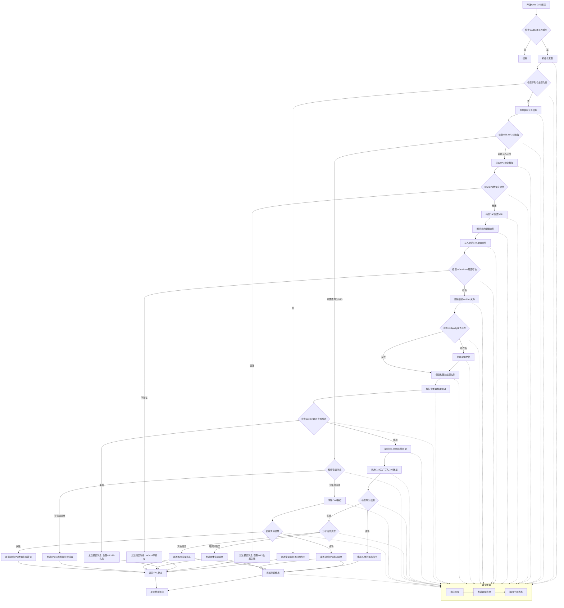

## 非品牌机
- [Non-branded\Tools](https://github.com/Charles-Miao/ManufacturingTestEngineerLib/tree/master/Non-branded/Tools)：Start is the main program for Runin Test & Function Test
- [Non-branded\Tools64\Route](https://github.com/Charles-Miao/ManufacturingTestEngineerLib/tree/master/Non-branded/Tools64/Route)：OnRack is the main program for Runin DL & SW DL
- [Non-branded\Path](https://github.com/Charles-Miao/ManufacturingTestEngineerLib/tree/master/Non-branded/Path): OnRack calls WINRUNIN and WINSWDL, then calls the RUNINDL and SWDL programs in %ProjectName%

## 品牌机

### Server
- 创建共享文件夹
- DHCP配置
- [WDS配置](https://github.com/Charles-Miao/ManufacturingTestEngineerLib/tree/master/Branded/Server/WDS配置.md)

### WinPE Image制作
- [WinPE: Mount and Customize](https://learn.microsoft.com/en-us/windows-hardware/manufacture/desktop/winpe-mount-and-customize?view=windows-11)

```batch
rem 装载 Windows PE 启动映像
Dism /Mount-Image /ImageFile:"C:\WinPE_amd64\media\sources\boot.wim" /index:1 /MountDir:"C:\WinPE_amd64\mount"
rem 添加WinPE-MDAC.cab 文件
Dism /Add-Package /Image:"C:\WinPE_amd64\mount" /PackagePath:"C:\Users\WT\Desktop\FBMFGPE\WinPE-MDAC.cab"  
rem 卸载并保存映像
Dism /Unmount-Image /MountDir:"C:\WinPE_amd64\mount" /commit
rem 卸载不保存映像
Dism /Unmount-Image /MountDir:"C:\WinPE_amd64\mount" /discard
rem 查看已安装的所有包
DISM /Image:"C:\Mount\WinPE" /Get-Packages
rem 查看所有已挂载的映像
DISM /Get-MountedImageInfo
rem 安装WinPE-MDAC.cab，既有odbcad32工具，此工具可以操作SQL Server
odbcad32
```
- **WinPE-MDAC**：支持 Microsoft 开放式数据库连接 (ODBC)、OLE DB 和 Microsoft ActiveX 数据对象 (ADO)。 这套技术提供对各种数据源（例如 Microsoft SQL Server）的访问。 例如，通过这种访问可以查询包含 ADO 对象的 Microsoft SQL Server 安装。 可以基于唯一的系统信息生成动态应答文件。 同样，可以生成数据驱动的客户端或服务器应用程序，用于集成来自各种数据源（关系型 (SQL Server) 和非关系型）的信息。
- **WinPE-MDAC**：可以从Windows ADK中获取或者从其他Wim文件中提取 

### SWDL1
#### startnet.cmd call ProductName.cmd
```batch
rem 初始化设定/联网/拷贝服务器资料等
rem 调起ProductName.cmd
```

#### ProductName.cmd call Check.cmd
```batch
rem 使用wmic和ReadSMBIOS.exe获取机种名，以便拷贝正确目录%ProductName%下的Check.cmd
rem 调起Check.cmd
```

#### [Check.cmd](https://github.com/Charles-Miao/ManufacturingTestEngineerLib/tree/master/Branded/LH/ATOTools/Project/check.cmd.md)
```batch
:Add-TPDriver rem 使用pnputil.exe安装
rem Get PCBA SN from DUT，使用'Wmic Baseboard Get SerialNumber /Value'读取
:Get_BOM rem 使用CURL获取
:ATOSetLogPath rem 将log目录设定到服务器上
:CheckACIN rem 通过'Wmic path win32_battery Get batterystatus /Value'检查机台是否插AC
rem Get BIOS/EC Version，通过Wmic接口读取机台BIOS/EC并记录到log中
:LIDCLOSE rem 使用DumpIO.exe设定盒盖不休眠
rem MFG Check/ SetToMFGMode，使用DumpIO.exe设定MFG模式
:settarget rem 使用DumpIO.exe设定目标电量为40
:enterCALIBRATION rem 使用DumpIO.exe设置电池RSOC校准模式
:diskUnsafeShutdowns rem smartctl.exe记录磁盘信息，diskinfo.exe读取不安全关机次数，并记录到log中
:ATOVer rem Get ATO version(测试image版本)
:DLATO rem 服务器没有ATO image，则记录到log中，并暂停
:PartitionDisk rem 格式化
rem Install image，通过DISM.exe install image
:BCDBOOT rem 执行设置启动项命令
:Reagentc rem 设置Windows恢复环境镜像
:bcdedit rem 设置测试签名模式为开启/设置恢复功能为禁用/设置重启失败后自动重启
:reg rem 添加系统首次启动后运行的任务
:Update rem 把image中Update内容和RunOnce.cmd拷贝到系统中
:MOPSPEDL2 rem 复制MOPS PE文件到指定目录
:Copy_EFI rem 复制bootmgfw.efi文件到指定位置
rem 拷贝log，并reboot
```

### FAT+FRT
#### RunOnce.cmd
```batch
Start Install_Update.cmd
rem 使用 devcon.exe 工具移除所有 SCSI 磁盘设备驱动
rem 以远程签名执行策略运行 PowerShell 脚本，禁用 Windows 更新任务计划
:Addstartup rem 向注册表 RunOnce 项添加键值，使系统下次启动时运行 C:\WTtools\GetTools.cmd
:WallpaperSet rem C:\WTtools\image\WallpaperSet.cmd 文件存在，则调用该脚本
rem WTIO.exe /w，无特别注释
:SSDUnsafe rem 执行 diskinfo.exe 工具，获取磁盘不安全关机次数，如果大于80则fail
rem SaveConsoleAsText.ps1，主要功能是将控制台的输出内容保存到 C:\WTTools\DL1.log 文件中
rem 强制重启计算机
```

```batch
rem Install_update.cmd
:Uninstall_cyusb3 REM 使用 pnputil 工具强制卸载指定的 cyusb3 驱动
:Reinstall_cyusb3 REM 使用 pnputil 工具安装指定路径下的 cyusb3 驱动
:install_CH341WDM REM 使用 pnputil 工具安装指定路径下的 CH341WDM 驱动
:Disabel_Defender_Notificationy REM regedit静默执行指定路径下的注册表文件
```

```batch
rem WallpaperSet.cmd
REM 获取 BIOS 版本信息
REM 使用 magick.exe 工具，在 img0.jpg 图片的 (250, 341) 位置以红色 40 号字体添加 BIOS 版本信息，生成新图片 img0_new.jpg
REM 以无配置文件和绕过执行策略的方式运行Set-Wallpaper.ps1脚本，设置桌面壁纸
```
```POWERSHELL
# Set-Wallpaper.ps1
# 定义了一个名为Set-Wallpaper的函数(C#)，用于设置Windows系统的桌面壁纸，最后调用该函数将指定路径的图片设置为桌面壁纸
```

#### GetTools.cmd
```batch
:GETDHCP rem 获取DHCP Server IP
rem net config workstation 命令，获取用户名是否为 "WT"
rem ipconfig /all ^|find "Ethernet adapter Ethernet"，获取网卡名称
rem netsh advfirewall set publicprofile state off，关闭公共网络配置文件的防火墙
:ProductName rem 用于获取产品名称
rem net use/ net time，连接服务器，同步时间
rem Get PCB SN from machine by WMI
:DLATOTools rem 将testtool目录中的所有内容拷贝到桌面上，将部分自动化工具拷贝到C盘根目录
Start FAT.bat
```

#### [FAT.bat](https://github.com/Charles-Miao/ManufacturingTestEngineerLib/tree/master/Branded/LH/Testtool/ProjectName/FAT.md)
```batch
:UnzipATS rem 若当前脚本所在目录下存在 ATS.zip 文件，则调用 7z.exe 解压到 C 盘根目录，覆盖已有文件
:PCBSN rem 使用wmic获取PCBA SN
:STATIONRESULT rem 设定测试结果文件路径
:TargetIP rem 获取DHCP Server IP
:GetStation rem 向 MES 系统发送 POST 请求，查询测试站记录，并将%Station%设定为对应站别[FAT/FRT/FFT/SWDL]
:GetToolVer rem 从mes回复的信息中获取工具版本号
:GetTool rem 删除tool目录，重新解压%toolver%.7z
:DeleteData rem 删除tool生成的相关数据
:IfFRTFFTSWDL rem 如果是FRT/FFT/SWDL站别，则调起FRT.bat/FFT.bat/SWDL.bat
:FloatMode rem 用于设置浮动模式
:DisableLid rem 用于禁用盖子功能
rem 删除所有无线局域网配置文件
call NoteBookTest.exe N69528_FAT
```

#### NoteBookTest.exe N69528_FAT
- FlashBiosTest 
```C#
//检查 AC 状态，WtDevTool.exe -GetBatteryPowerInfo
//确认离线模式，读取配置档mMainCfg.AbsoluteSysCfg.MESCfg.EnableOnLine
//获取电池电量百分比，WtDevTool.exe -GetBatteryPowerInfo
#region battery电量小于30%等待
//设置电池浮动模式，开启工厂模式，通过inpout32.dll设定对应EC Address的Data
#region Get Local BIOS Version
//获取本地 BIOS 版本信息，WtDevTool.exe -CheckSMBIOS
//flashBiosCount是记录 BIOS 刷写次数的文件
//DeleteRunExe，删除启动项"C:\ProgramData\Microsoft\Windows\Start Menu\Programs\StartUp"
//DownloadBiosBin，创建 FTP 客户端实例FtpClient ftp（连接，获取列表，下载，断开连接）
//SetRunExe，将现有正在执行的NoteBook.exe设定为开机启动项
#region 刷正常版本BIOS
//执行OtherTool\BiosUnlock\Bios_unLock.exe
//执行下载的BIOS文件，OtherTool\FlashBios\*.exe
```
- Disktest
```C#
//GetLocalDiskInfo，WtDevTool.exe -GetDiskInfo 1
//过滤移动硬盘，只保留非移动硬盘
#region Disk Count
//根据配置档是否启用硬盘数量检查，需要则检查，不需要则不检查
#region Disk Total Size
//根据配置档是否启用硬盘总容量检查，需要则检查，不需要则不检查
#region Disk Info Check
//CheckMESDiskInfo函数，检查UnsafeShutdownsCount/PowerCycleCount/PowerOnHours/CRCErrCount/FirmwareRevision(如果FW不一致，则调用OtherTool\SSDFW\SSDUpdateTool.exe升级固件版本)/ModelName硬盘型号名称
```
- MainBoardTest
```C#
//检查 AC 状态，WtDevTool.exe -GetBatteryPowerInfo
//检查驱动状态，WtDevTool.exe -CheckDeviceList 0 {0}
#region RTC TEST
//SetRTCTime()，执行 RTC 测试
//设定RTC时间，透过Out32给EC下指令，如果设置后的时间与当前时间差值小于 5 秒，则设置成功
//检查RTC时间，透过Out32给EC下指令，如果获取的 RTC 时间与当前时间差值在允许范围内，则检查通过
#region BIOS Check
//InitSMBIOSData()，"WtDevTools.exe -CheckSMBIOS 1"读取的BIOS信息中的BIOS版本和EC版本使用wmic读取版本进行替换，以方便后续检查
//wmic.exe bios get smbiosbiosversion /Value
//WMIC.exe bios Get EmbeddedControllerMajorVersion /Value
//WMIC.exe bios Get EmbeddedControllerMinorVersion /Value
//BIOSInfoCheck()
//比较 SMBIOS 中的 BIOS 供应商信息和配置中的信息
//如果 MES 在线且 BIOS 版本信息为空，则标记测试失败并返回
//如果 BIOS 版本信息不为空，则检查 BIOS 版本信息
//如果系统 BIOS 版本信息不为空，则检查系统 BIOS 版本信息
//如果 MES 在线且 EC 固件版本信息为空，则标记测试失败并返回
//如果 EC 固件版本信息不为空，则检查 EC 固件版本信息
//比较 SMBIOS 中的系统产品名称信息和配置中的信息
//比较 SMBIOS 中的系统 SKU 编号信息和配置中的信息
//比较 SMBIOS 中的系统家族信息和配置中的信息
//比较 SMBIOS 中的主板产品名称信息和配置中的信息
//比较 SMBIOS 中的主板制造商信息和配置中的信息
//比较 SMBIOS 中的主板资产标签编号信息和配置中的信息
#region Processor check
//CPUInfoCheck()
//比较 SMBIOS 中的 CPU 版本信息和 MES 中的信息
//比较 SMBIOS 中的 CPU 最大速度信息和配置中的信息
//比较 SMBIOS 中的 CPU 当前速度信息和配置中的信息
#region Memory check
//MemoryInfoCheck()
//比较本地内存总大小和配置中的信息
//比较内存Speed和配置中的信息
//检查内存PartNumber是否在配置列表中
#region PD FW Check
//PDFWCheck()，使用OtherTool\PDFW\TypeCDump.exe读取PD FW并与MES比对
#region GPU Check
//GPUInfoCheck()
//InitGPUData()，使用WtDevTools.exe -GetGpuInfo 1获取GPU信息
//GetDeviceIds(), WtDevTools.exe -GetHardwareId "Microsoft Basic Render Driver"
//GPU VBIOS 版本信息不为空且 MES 中的 GPU 型号名称信息为空
//GPU 型号名称信息不为空且本地 GPU VBIOS 版本信息为空
//检查配置中是否包含本地 GPU 设备 ID 信息
//检查配置中的 GPU 型号名称信息和本地信息
//检查配置中的 GPU 供应商 ID 信息和本地信息
//如果是NVIDIA GPU则检查配置中的 GPU VRAM 信息和本地信息
//检查配置中的 GPU VBIOS 版本信息和本地信息
#region EC Power Type
//DcBoot()
//OtherTool\HuaweiECtool\HuaweiECtool.exe /ecpower /get_type，获取 EC 电源类型，是否包含 "DC"
//OtherTool\HuaweiECtool\HuaweiECtool.exe /ecpower /get_time，获取 EC 电源时间，是否电源时间为 255
#region Thermal Sensor Check
//ThermalSensorCheck(), 各个sensor的温度范围需要在1~100
//GetAllTemperature(), 读取各个sensor的温度，CPU_DTS/ PCH/ NTC_CHARGER/ NTC_CPU/ NTC_DDR/ NTC_CPUVR/ NTC_5V/ NTC_AMBIENCE/ NTC_TYPEC/ NTC_PowerVR
//ReadTemperatureData(), 透过Out32给EC下指令, 读取各个sensor的温度
#region VR FW Check
//VrFwCheck()
//VrUpdateFw()，透过Out32给EC下指令更新 VR FW
//透过Out32给EC下指令获取本地VR CRC值localCrcValue
//OtherTool\CheckRPMC\CheckRPMC.exe rm FE0B00FC 1, 获取cpuType
//根据 CPU 类型设置CRC值crcValue
//比较本地CRC值localCrcValue和标准CRC值crcValue
```
- METest
```C#
#region ME Test
//OtherTool\METools\MEInfo64\MEInfoWin64.exe -FEAT "FW Version", 获取fwversion, 并与 MES 中的版本比对
//OtherTool\METools\MEManuf64\MEManufWin64.exe -VERBOSE, 检查获取到的结果
//OtherTool\METools\FlashTool\WINDOWS64\FPTW64.exe -R "Intel(R) ICPS Entitlement Eligible", Read icps status
//如果ICPS 标志位为 0，从WO中读取
//OtherTool\METools\FlashTool\WINDOWS64\FPTW64.exe -u -n "Intel(R) ICPS Entitlement Eligible" -v Disabled, 禁用 ICPS 
//OtherTool\METools\FlashTool\WINDOWS64\FPTW64.exe -commit -noreset
//重启计算机
//如果 ICPS 标志位为 1
//OtherTool\METools\FlashTool\WINDOWS64\FPTW64.exe -u -n "Intel(R) ICPS Entitlement Eligible" -v Enabled, 启用 ICPS
//OtherTool\METools\FlashTool\WINDOWS64\FPTW64.exe -commit -noreset
//重启计算机
//ME Close
//OtherTool\METools\FlashTool\WINDOWS64\FPTW64.exe -R "NVAR Configuration State", CHK ME CLOSE
//OtherTool\METools\FlashTool\WINDOWS64\FPTW64.exe -CLOSEMNF -NORESET -Y, 关闭ME
//set Mfg, 执行 EC 命令设置 Mfg 状态
//OtherTool\\InsydeH2OUVE\\H2OUVE-W-CONSOLEx64.exe -l, BIOS load default
```
- TPMTest
```C#
#region FTPM Check
//(Get-CimInstance Win32_ComputerSystem).OEMStringArray[3], 使用 PowerShell 命令获取主板型号信息
//(Get-TPM).TpmPresent, 使用 PowerShell 命令获取 TPM 是否存在的信息
//Start Tpm Provision
//mountvol.exe s: /s, 执行 mountvol 命令挂载虚拟磁盘
//OtherTool\\efishell\\efishell.bat
//重启计算机
//修改设置
//OtherTool\\InsydeH2OUVE\\H2OUVE-W-CONSOLEx64.exe -ms -fi "TXT" -op "Enable", 执行 UVE 工具命令，启用 TXT 设置
//OtherTool\\InsydeH2OUVE\\H2OUVE-W-CONSOLEx64.exe -ms -fi "Allow Microsoft 3rd Party UEFI CA" -op "Enable",执行 UVE 工具命令，启用允许 Microsoft 3rd Party UEFI CA 设置
```
- FanTest
```C#
//FanTestEnzo()
//执行EC指令，SetFanTestMode
//执行EC指令，SetFanSpeed
//OtherTool\CheckRPMC\CheckRPMC.exe rm FE0B002C 4，ReadAllFanRPM
//EnableRunInTestFan, 使用如上方法分别进行低速/中速/高速风扇测试
//EnableTestSingleFan, SFT Fan Speed, 调用风扇控制测试方法进行单风扇低速测试
//如果未设定EnableRunInTestFan/EnableTestSingleFan，则使用如上方法分别进行低速/中速/高速风扇测试
//若所有测试都通过，将风扇速度设为 0
//调用 EC 命令将风扇测试模式设为 false
//Fan Noise Test
//执行 EC 命令，设置风扇进入测试模式
//人工反馈测试结果
// 执行 EC 命令，设置风扇退出测试模式
```
- KeyboardTest
```C#
//执行EC命令，设置 Fn 键进入测试模式
//执行EC命令，设置 Fn 键功能模式
#region Pre ACTION Test
//OtherTool\BTMCU\FwCmdTool.exe hall status, 执行厂商预操作测试
#region Init Test Key List
//初始化要测试的按键列表
#region KeyBoard Test Show
//在 UI 线程中执行键盘测试界面显示操作
//显示键盘测试对话框并等待用户操作
                dlg.ShowDialog();
//OtherTool\BTMCU\LogTools.exe remove kbd, 执行厂商结束操作测试
//设置 Fn 键退出测试模式
//设置 Fn 键退出功能模式
```
- ClickpadTest
```C#
#region Get Device ID
//GetDeviceIds, WtDevTool.exe -GetHardwareId "HID-compliant touch pad"
#region FW Check
//检查和解析MES中的TouchPad固件版本
//UpdateFwVersion
//ClickpadVendor.GOODIX, OtherTool\ClickpadFwUpdate\GTModuleTest\GTModuleTest.exe
//ClickpadVendor.SIPO, OtherTool\ClickPadFW\SIPO_FWUpdate\SIPO_TP_Updater.exe
//ClickpadVendor.BLTP, OtherTool\ClickpadFwUpdate\BLTP\CmdUpgradeFw_HWID785_V2.14.01_20241008(1154).exe
//更新完FW之后，重启系统，并将现有进程设为开机启动项目
//GetFwVersion
//ClickpadVendor.FTCS, OtherTool\ClickPadFW\FTCS\UpgradeToolV3.exe /s /Ver
//ClickpadVendor.GOODIX, OtherTool\ClickPadFW\GTModuleTest\GTouchUpdate.exe并未执行
//ClickpadVendor.SIPO, OtherTool\ClickPadFW\SIPO\SIPO_TP_ReadVer.exe
//ClickpadVendor.BLTP, OtherTool\ClickPadFW\BLTP\CmdUpgradeFw.exe check 347D 7853 FF00 01
//检查本地固件版本是否与 MES 中的版本匹配
#region Self Test
//ClickpadVendor.GOODIX, OtherTool\ClickPad\GTModuleTest\GTModuleTest.exe(复制配置文件/删除结果/Kill进程/启动工具/超时处理/重试/备份测试日志)
//ClickpadVendor.SIPO, OtherTool\ClickPad\SIPO\SipoTpChecker.exe
//ClickpadVendor.BLTP, OtherTool\ClickPad\BLTP\BLTPTest.exe
#region Function Test
//触摸板功能测试, 显示对话框并等待用户操作
touchpadDlg.ShowDialog();
```
- LCDTest
```C#
#region INTEL 专用
// 查询无线网卡名称，wmic /namespace:\\root\CIMV2 path Win32_NetworkAdapter get *
// 检查 DPCD 的功能， 针对包含 "INTEL"无线网卡专用，执行停止 DRTU 进程的批处理文件，UninstallWifiDevices()
// UninstallWifiDevices，C:\Windows\sysnative\pnputil.exe /remove-device /deviceid "{deviceId}"
#region Battery Control
// 如果当前客户为华为且当前工位为 "A_FRT"
// 停止电池充电
// 获取电池电量百分比
// 如果电池电量大于等于 75%, 设置电池进入学习模式
#region Check Monitor Config
// GetMonitorInfo(), WtDevTools.exe -GetMonitorList, 并将MonitorId/EDIDDate/EDIDVersion/SerialNumber/MonitorName/EDIDChecksum等信息加入到相应列表中
#region MonitorId
// MonitorId Check
#region MonitorName
// MonitorName Check
#region EDIDVersion
// EDIDVersion Check
#region SerialNumber
// SerialNumber Check
#region EDIDChecksum
// EDIDChecksum Check
#region Check LCD FW
// CheckSum()
// 如果 LCD 类型包含 "EDO1420"则执行OtherTool\LCDCheckSum\EDO\HWDisplayService.exe，获取lcdversion并Check LCD FW Version
// 如果 LCD 类型包含 "BOE092E"则执行OtherTool\LCDCheckSum\BOE_High_Gamut\Aux_Checksum_tool.exe，获取lcdversion并Check LCD FW Version
// 如果 LCD 类型包含 "CSO1421"则执行OtherTool\LCDCheckSum\CSOT_Low_Gamut\TCON_DP_UPDATE_TOOL.exe, 获取lcdchecksum Check LCD checksum
// 如果 LCD 类型包含 "CSO1422"则执行OtherTool\LCDCheckSum\CSOT_High_Gamut\TCON_DP_UPDATE_TOOL.exe，获取lcdchecksum Check LCD checksum
// DownloadFwFile(), 透过FTP下载FW文件
// FwUpdate(), 执行升级工具进行固件升级, GenericFun.GetExecResult(tool, $"upgrade {bin}", 1);
#region EnableBrightnessTest
dlg.ShowDialog();
#region Enable PictureShow Test
// 如果无线适配器名称包含 "INTEL"，OtherTool\DRTU\init.bat
// DRTU -daemon
// DRTUClient.exe -connect
// DRTUClient.exe -wifi-stop 
// DRTUClient.exe -wifi-reset-config 
// DRTUClient.exe -wifi-tx-send-packets-mode Off 
// DRTUClient.exe -wifi-mcc-profile US
// DRTUClient.exe -wifi-set-mcc 
// DRTUClient.exe -wifi-mode tx_modulated 
// DRTUClient.exe -wifi-calibrate-tx 
// DRTUClient.exe -wifi-band 2.4 
// DRTUClient.exe -wifi-bandwidth 20 
// DRTUClient.exe -wifi-channel 7
// DRTUClient.exe -wifi-tx-transm-mode STBC 
// DRTUClient.exe -wifi-tx-chains A,B 
// DRTUClient.exe -wifi-rate HT7 
// DRTUClient.exe -wifi-tx-frame-size 1528 
// DRTUClient.exe -wifi-duty-cycle 85 
// DRTUClient.exe -wifi-power-mode Wifi.PowerControl 
// DRTUClient.exe -wifi-power a,24 
// DRTUClient.exe -wifi-power b,24 
// DRTUClient.exe -wifi-start 
// 如果本地显示器信息中的 MonitorId 包含 "BOE", "BOE low gamut LCD, no need biterror check", 否则ReadLcdLinkErrorDataForBOE() ==>OtherTool\BitErrorCheck\BOE\DP689_Eye_Monitor.bat
// 如果本地显示器信息中的 MonitorId 包含 "CSO", ReadLcdLinkErrorDataForCSOT() ==> OtherTool\BitErrorCheck\CSOT\RX_BER_Aux_Tool.exe
// 如果本地显示器信息中的 MonitorId 包含 "EDO", ReadLcdLinkErrorDataForEDO() ==> OtherTool\TconEquipmentTool_PsrState\TconEquipmentTool_PsrState.exe & OtherTool\BitErrorCheck\EDO\HWDisplayService.exe
// 创建图片显示测试对话框实例(red/ green/ blue/ white/ black/ mt/ L48/ caitiao)
dlg.ShowDialog();
// 如果启用了检查 DPCD 的功能, Wait Test Bit Error End
#region Exit DRTU
// OtherTool\DRTU\stop_exit4.bat
// DRTUClient.exe -wifi-stop
// DRTUClient.exe -disconnect true
// DRTUClient.exe -exit
// taskkill /f /im rservice.exe
// taskkill /f /im DRTU.exe
// taskkill /f /im cmd.exe /fi "windowtitle eq Administrator:  1"
// taskkill /f /im cmd.exe /fi "windowtitle eq Administrator:  2"
// taskkill /f /im cmd.exe /fi "windowtitle eq Administrator:  3"
// taskkill /f /im cmd.exe /fi "windowtitle eq Administrator:  loopDRTU"
// taskkill /f /im timeout.exe
// taskkill /f /im ping.exe
// devcon remove %WlanHWID%
// devcon rescan
```
- CameraTest
```C#
#region Get Cam Name + DevId
// GetCameraNameAndId(), WtDevTool.exe -CheckDeviceList 1 (rear Camera/ Front Camera/ USB Camera)
#region Check Device Id
// 检查mes中的camera信息，并与读取到的camera信息进行比对
#region Get Rear Camera SN and Pass to MES
// OtherTool\CameraEEprom\EEPRomTest.exe -r 0 2400 "Camera Sensor Rear"
#region CycleTest
// 禁用/启用后置摄像头，禁用/启用前置摄像头，检查摄像头驱动是否有黄色标记
// C:\Windows\sysnative\pnputil.exe /disable-device /deviceid %rearcameraid%
// C:\Windows\sysnative\pnputil.exe /enable-device /deviceid %rearcameraid%
// C:\Windows\sysnative\pnputil.exe /disable-device /deviceid %frontcameraid%
// C:\Windows\sysnative\pnputil.exe /enable-device /deviceid %frontcameraid%
// OtherTool\DeviceYellowCheck\DeviceYellowCheck.exe
#region Camera View
#region 若为红外摄像头
// IRCameraTest()
// 将启动 UWP 应用的命令写入脚本文件, "explorer.exe shell:appsFolder\1d1cd9d5-9968-4df1-a750-16a5123fa763_6994g6hn1sjr2!App"写入OtherTool\IRCamera\uwp.bat
// 执行 UWP 测试脚本, OtherTool\IRCamera\uwp.bat
// CameraTestFinalResult(), iqCapturesPath目录下文件为4个则返回true
// KillIQCapture(), kill IQCapture进程
// 解析红外摄像头照片亮度
// FileToBitmap(), 将文件转换为 Bitmap 对象
// GetPicColorCountAndLightness(), 获取图片的颜色数量和亮度值
// 若颜色数量大于 80 且亮度值大于 9000
# region 若为普通摄像头
// 执行OtherTool\CameraView\CameraView.exe 1 2 0, [参数1：3 isCheckQrcode, 1 isnot check qrcode], [参数3：0 is front camer, 1 is rear camera]
#region Camera Video record
// 待实现...
```
- BatteryTest
```C#
#region CHECK AC INPUT
// CheckACState()，WtDevTool.exe -GetBatteryPowerInfo
#region 电池生产日期
// 对EC下指令，获取电池生产日期
// 计算当前日期与电池生产日期的天数差
// 若天数差超过限制，则测试失败
#region 电池温度高于门限则等待30分钟，超时Fail
// 透过EC指令，读取电池温度
// 若电池温度低于下限，则测试失败
// 若电池温度高于上限，则透过EC指令设置电池停止充放电模式
// 若等待时间超过 30 分钟，电池温度还未正常，则测试失败
#region 放电电流测试
// 控制电池容量范围在 15% 到 95% 之间
BatteryCapacityRangeControl(15, 95) //透过EC指令，退出所有测试模式/ 设置电池浮充模式/ 设置电池浮充限制/ 读取电池容量/ 读取电池电流/ 若电池容量在目标范围内，跳出循环
// 透过EC指令，退出所有测试模式
// 透过EC指令，设置电池强制放电模式
// 指定时间内有连续 5 次放电电流(透过EC指令读取)不满足门限则 FAIL
// 透过EC指令，取消电池强制放电模式
#region 电芯压差
// 控制电池容量范围在 15% 到 50% 之间
BatteryCapacityRangeControl(15, 50);
// 设置电池停止充放电模式
// 获取电池电芯电压列表
// 若压差未超过 35，设置是否通过标志为 true
// 取消电池停止充放电模式
#region 电池满充容量检测
// 获取电池设计容量
// 读取电池满充容量
// 若满充容量符合要求，设置测试状态为通过
#region 放电电量跳变测试
// 控制电池容量范围在 15% 到 50% 之间
BatteryCapacityRangeControl(15, 50);
// 退出所有测试模式
// 设置电池强制放电模式
// 第一次读取电池电量
// 第二次读取电池电量
// 读取电池电流
// 若两次读取电量差值超过 3，失败计数加 1
// 若失败计数超过 4 次，设置测试状态为失败
// 若两次读取电量差值未超过 3，失败计数重置为 0
// 若总测试时间达到配置要求，跳出循环
// 取消电池强制放电模式
#region 充电电流测试
// 控制电池容量范围在 15% 到 50% 之间
BatteryCapacityRangeControl(15, 50);
// 退出所有测试模式
// 读取电池充电电流
// 将充电电流添加到列表
// 若总测试时间达到配置要求，跳出循环
// 若平均充电电流超出范围，发送充电测试失败消息
#region TestEnd
// 若当前工位名称包含 "FRT"，控制电池容量范围在 15% 到 50% 之间
BatteryCapacityRangeControl(15, 50);
// 若当前工位名称不包含 "FRT"，控制电池容量范围在 15% 到 95% 之间
BatteryCapacityRangeControl(15, 95);
```
- WifiTest
```C#
#region Get Wifi Adapter
localWifiName=Generic.GenericFun.QueryWirelessNetworkAdapterName();
//Powershell指令：Get-CimInstance -Namespace root/CIMV2 -ClassName Win32_NetworkAdapter
//CMD指令：wmic /namespace:\\root\CIMV2 path Win32_NetworkAdapter get *
#region Get Wifi Device Id
// 尝试获取设备 ID、驱动版本和设备 ID 列表，若失败则设置测试状态为失败并发送错误消息
GetDeviceIds(localWifiName, out driverVersion, out DeviceId, out _IdList)
// 使用 WlanClient 实例确保 Wifi 接口处于开启状态
// using 语句确保 WlanClient 对象在使用后自动释放资源（如网络句柄），避免资源泄漏
// WlanClient()
// 1. 通过 Windows 原生 WLAN API 打开与无线服务的连接（获取句柄）；
// 2. 注册一个回调函数，用于监听所有 WLAN 相关的状态变化；
// 3. 确保在初始化失败时正确释放资源，避免内存泄漏。
#region Check Device Id
// 检查本地设备 ID 是否包含 MES 中的设备 ID
#region Check Wlan Type
// 检查本地 Wifi 适配器名称是否包含 MES 中的 WLAN 类型
#region 驱动检查测试
// C:\Windows\sysnative\pnputil.exe /disable-device /deviceid "你的设备ID"
// 线程休眠 5 秒
// C:\Windows\sysnative\pnputil.exe /enable-device /deviceid "你的设备ID"
// 线程休眠 5 秒
// 检查设备是否有黄色标记，若有则设置测试状态为失败并发送错误消息
// 初始化 WlanClient 实例
// 获取 RSSI 最强的网络 BSS 信息
// 若 RSSI 值小于配置值，设置测试状态为失败并发送错误消息
#region Connect Test
// 执行 Wifi 连接测试，连接上则pass
#region 检查可用网络数量
// 若可用网络数量大于等于 3，设置找到标志为 true 并发送成功消息
#region WIFI RSE TEST
// 透过powercfg工具，设置电源策略，防止影响 Wifi 性能
// 尝试进入 TAS 切换模式，若失败则设置测试状态为失败并发送错误消息
// 检查到位状态，获取测试 SSID 和箱体编号
// 根据 Wifi 适配器名称创建对应的 Wifi 模块实例
// INTEL:
// AntRssiTest()
// 重启Wifi，检查SSID，获取上下限值
// 透过EC指令Enable TAS, Disable TAS，调用Ant2GTest(), Ant5GTest()
// OtherTool\Intel_ant_tool\Ant.exe -network "SSID值" -password "密码值" -ant_all -rssi_loops 10 -th 60
// REALTEK:
// OtherTool\Realtek_ant_tool\RtkAntTest.exe
// 尝试退出 TAS 切换模式，若失败则设置测试状态为失败并发送错误消息
```
- BluetoothTest
```C#
#region 启用/禁用测试
// 类似wifi的测试原理，禁用后再启用，然后检查是否有黄标
#region 蓝牙搜索测试
// FindCommonBluetooth()，该方法通过 Windows 设备管理 API，在指定超时时间内扫描并筛选出 “可配对” 或 “已配对” 的蓝牙设备，收集设备名称和 ID 信息，最终返回这些设备的列表
// 若找到设备，设置测试状态为通过并发送找到的设备信息
#region 蓝牙连接测试
// BluetoothConnectTest()
// 执行蓝牙 GATT 工具命令，OtherTool\BLEGATT\BlutoothLEGatt.exe /c
// 若连接测试成功，设置测试状态为通过并发送成功消息
```
- FingerPrintTest
```C#
// 获取本地指纹设备类型和设备 ID
// GetFingerprintTypeAndDeviceId(), WtDevTool.exe -CheckDeviceList 1
#region Check Device ID
// 检查本地设备 ID 是否包含 MES 中的设备 ID, 若包含则pass
#region Self Test
// 不同的设备类型调用不同的工具
case FingerprintType.ELAN:
    fingerTool = AppDomain.CurrentDomain.BaseDirectory + @"OtherTool\Fingerprint\Elan\eFSAX System Test Manager.exe";
case FingerprintType.GOODIX:
    fingerTool = AppDomain.CurrentDomain.BaseDirectory + @"OtherTool\Fingerprint\Goodix\MassProductTest.exe";
case FingerprintType.GOODIXMOC:
    fingerTool = AppDomain.CurrentDomain.BaseDirectory + @"OtherTool\Fingerprint\GoodixMOC\GFMPTestMOC.exe";
case FingerprintType.FOCALTECH:
    fingerTool = AppDomain.CurrentDomain.BaseDirectory + @"OtherTool\Fingerprint\FocalTech\FpsensorTestw.exe";
case FingerprintType.SIL:
    fingerTool = AppDomain.CurrentDomain.BaseDirectory + @"OtherTool\Fingerprint\SIL\ManuTester.exe";
case FingerprintType.FPC:
    fingerTool = AppDomain.CurrentDomain.BaseDirectory + @"OtherTool\Fingerprint\FPC\FPCProductionTestTool.exe";
case FingerprintType.EGIS:
    fingerTool = AppDomain.CurrentDomain.BaseDirectory + @"OtherTool\Fingerprint\Egis\HonorPC-ETU906_Fingerprint_Stress_Tool.exe";
```
- TouchpanelTest
```C#
// 若为非触摸屏，则goto TestEnd
// 触控面板厂商自检测试，不同厂商使用不同的工具
// FermatBTouch, OtherTool\TouchSelf\FT_MultipleTest.exe
// EnzoHTouch, OtherTool\TouchSelf\FtMultipleTest_V2.1.exe
// X80Touch, OtherTool\TPVendorTool\NovatekTouch\Production_Studio.exe
// D580Touch, OtherTool\TPVendorTool\HxWinTouchMP\HxWinTouchMP.exe
// 划线测试, OtherTool\TouchTool\TouchLine\TouchLineTest.exe
// 多指触控测试, OtherTool\TouchTool\MultiTouch\MultiTouchTest.exe
// 触控面板固件检查, OtherTool\TouchFW\FtGetFwVer_V1.1.exe读取FW版本，并和MES版本进行比对
```
- WriteNumber
```C#
// 最底层就是使用FermatB.cs中的方法
// WriteSMBIOS
#region Logo设置
HWLogoSet() //校验logo的SHA256，并执行\OtherTool\Logo\SetLogo.bat
#region HW Native注入
HWNativeWrite() //ftp DownloadNativeFile，并执行OtherTool\Native\*.exe
#region PSI写入
GetHWPSI3Version() //OtherTool\WtDevTools.exe -RHWPSI3
ReadHWPSIFlag() //OtherTool\WtDevTools.exe -RWHWPSI R
WriteHWPSIFlag() //若读取的PSIFlag不正确，则写入，WtDevTools.exe -RWHWPSI W %HwPsiArea% %HwPsiControl% %HwPsiUserRequest%，并重启系统
HWPSIErase() //若MES PSI ver为空则erase，"%~dp0OtherTool\METools\FlashTool\WINDOWS64\FPTW64.exe" -f "%~dp0OtherTool\HWPSI\bin\PSIKeyNull.bin" -A 0xE00000 -L 0x100000 -Y，重启系统
HWPSIWrite() //若PSI ver错误则写入，"%~dp0OtherTool\METools\FlashTool\WINDOWS64\FPTW64.exe" -f "%localPsiPath%\%psifile%" -A 0xE00000 -L 0x100000 -Y，重启
#region WriteUUID
// "%~dp0OtherTool\InsydeH2OSDE\H2OSDE-Wx64.exe" -SU "auto"
#region BIOS_TYPE0_INFO_VENDOR
// "C:\YourApp\OtherTool\InsydeH2OSDE\H2OSDE-Wx64.exe" -BVDR %vendername%
#region BIOS_TYPE1_SYS_INFO_MANUFACTURER
// "C:\YourApp\OtherTool\InsydeH2OSDE\H2OSDE-Wx64.exe" -SM %manufacturer%
#region BIOS_TYPE1_SYS_VERSION
// "C:\YourApp\OtherTool\InsydeH2OSDE\H2OSDE-Wx64.exe" -SV %version%
#region BIOS_TYPE1_SKUNumber
// "C:\YourApp\OtherTool\InsydeH2OSDE\H2OSDE-Wx64.exe" -SKU %skunumber%
#region BIOS_TYPE1_PRODUCT
// "C:\YourApp\OtherTool\InsydeH2OSDE\H2OSDE-Wx64.exe" -SP %productname%
#region BIOS_TYPE1_Family
// "C:\YourApp\OtherTool\InsydeH2OSDE\H2OSDE-Wx64.exe" -SF %family%
#region BIOS_TYPE2_VERSION
// "C:\YourApp\OtherTool\InsydeH2OSDE\H2OSDE-Wx64.exe" -BV %version%
#region BIOS_TYPE2_ASSETTAG
// "C:\YourApp\OtherTool\InsydeH2OSDE\H2OSDE-Wx64.exe" -W H=2 S=5 V=%assettag%
#region BIOS_TYPE2_PRODUCT
// "C:\YourApp\OtherTool\InsydeH2OSDE\H2OSDE-Wx64.exe" -BP %productname%
#region BIOS_TYPE2_MANUFACTURER
// "C:\YourApp\OtherTool\InsydeH2OSDE\H2OSDE-Wx64.exe" -BM %manufacturer%
#region BIOS_TYPE3_ASSETTAGNUM
// "C:\YourApp\OtherTool\InsydeH2OSDE\H2OSDE-Wx64.exe" -CA %assettagnumber%
#region BIOS_TYPE3_MANUFACTURER
// "C:\YourApp\OtherTool\InsydeH2OSDE\H2OSDE-Wx64.exe" -CM %manufacturer%
#region BIOS_TYPE3_SKUNUMBER
// "C:\YourApp\OtherTool\InsydeH2OSDE\H2OSDE-Wx64.exe" -CSKU %skunumber%
#region BIOS_TYPE3_VERSION
// "C:\YourApp\OtherTool\InsydeH2OSDE\H2OSDE-Wx64.exe" -CV %version%
#region BIOS_TYPE11_String
// "C:\YourApp\OtherTool\InsydeH2OSDE\H2OSDE-Wx64.exe" -OS %stringIndex% %content%
#region Write MBSN
// "C:\YourApp\OtherTool\InsydeH2OSDE\H2OSDE-Wx64.exe" -BS %ssn%, write
// "C:\YourApp\OtherTool\InsydeH2OSDE\H2OSDE-Wx64.exe" -BS, read
#region WriteSSN
// "C:\YourApp\OtherTool\InsydeH2OSDE\H2OSDE-Wx64.exe" -SS %mbsn%, write
// "C:\YourApp\OtherTool\InsydeH2OSDE\H2OSDE-Wx64.exe" -CS %mbsn%, write
// "C:\YourApp\OtherTool\InsydeH2OSDE\H2OSDE-Wx64.exe" -SS, read
#region 上传WIFI/BT MAC
// OtherTool\WtDevTools.exe -CheckDeviceList 1
// OtherTool\Bat\getmac.bat
#region Write OA3
// 从MES获取OA3标志位OA3DATA.ProductKey & OA3DATA.ProductKeyID
// 构建OA3配置XML, OtherTool\OA3tool\x86\FileBasedInput.xml
OA3CFG.Append("<?xml version=\"1.0\"?>\n");
OA3CFG.Append("<Key>\n");
OA3CFG.Append("  <ProductKeyState>2</ProductKeyState>\n");
OA3CFG.AppendFormat("  <ProductKey>{0}</ProductKey>\n", OA3DATA.ProductKey);
OA3CFG.AppendFormat("  <ProductKeyID>{0}</ProductKeyID>\n", OA3DATA.ProductKeyID);
OA3CFG.Append("</Key>\n");
// 创建配置文件（如果不存在）OtherTool\OA3tool\x86\config.cfg
File.WriteAllText(OA3ToolDir + "config.cfg", "<OA3>\n    <FileBased>\n        <InputKeyXMLFile>FileBasedInput.xml</InputKeyXMLFile>\n    </FileBased>\n    <OutputData>\n        <AssembledBinaryFile>oa3.bin</AssembledBinaryFile>\n        <ReportedXMLFile>oa3.xml</ReportedXMLFile>\n    </OutputData>\n</OA3>\n");
// 创建构建OA3的批处理文件
var buildoa3Bat = OA3ToolDir + "BuildOA3.bat";
File.WriteAllText(buildoa3Bat, "del oa3.bin \n timeout 1 \n oa3tool.exe /Assemble /Configfile=config.cfg\n");
// 执行批处理文件构建OA3
// 调用InsydeWriteOA3中的Write方法写入OA3数据
exe = AppDomain.CurrentDomain.BaseDirectory + @"OtherTool\InsydeH2OOAE\H2OOAE-Wx64.exe";
// Write方法：写入OA3文件到系统
// 执行比较命令，检查OA3文件与系统当前状态
Generic.GenericFun.GetExecResult(exe, string.Format("-C {0}", OA3FileName));
// 1. 如果MSDM表不存在，需要写入OA3
// 执行写入命令，-W表示写入，-S表示静默模式
Generic.GenericFun.GetExecResult(exe, string.Format("-W {0} -S", OA3FileName));
// 2. 如果系统OA密钥与文件不匹配，需要先擦除再处理
// 执行擦除命令，-E表示擦除，-S表示静默模式
Generic.GenericFun.GetExecResult(exe, "-E -S");
// 3. 如果系统OA密钥与文件匹配，无需操作
// 如果写入成功，重启系统
// 处理不需要写入OA3的情况
// 调用InsydeWriteOA3中的Erase方法擦除OA3数据
// Erase方法：擦除系统中的OA3数据
Generic.GenericFun.GetExecResult(exe, "-E -S");
#region Write NFCKey
// OtherTool\NFCTool\NFCInfoTool.exe 8
#region WriteBtMCUMac
// 无实际作用，直接return TestState.PASS
#region CheckBtMCUMa 
// 无实际作用，直接return TestState.PASS
```
- Write OA3流程图

- WriteNumberCheck
```C#
#region BIOS INFO
// OtherTool\WtDevTools.exe -CheckSMBIOS
#region GET MES WRITE SN DATA
// 获取MES写入的SN数据
#region Type0Vendor
// 比对MES和读取的值
#region Type1Manufacturer
// 比对MES和读取的值
#region TYPE1ProductName
// 比对MES和读取的值
#region TYPE1Version
// 比对MES和读取的值
#region Type1SerialNumber
// 比对MES和读取的值
#region Type1SKUNumber
// 比对MES和读取的值
#region Type1Family
// 比对MES和读取的值
#region Type2Manufacturer
// 比对MES和读取的值
#region Type2AssetTag
// 比对MES和读取的值
#region Type2Product
// 比对MES和读取的值
#region Type2Version
// 比对MES和读取的值
#region Type2SerialNumber
// 比对MES和读取的值
#region Type3Manufacturer
// 比对MES和读取的值
#region Type3AssetTag
// 比对MES和读取的值
#region Type3Version
// 比对MES和读取的值
#region Type3SerialNumber
// 比对MES和读取的值
#region Type3SKUNumber
// OtherTool\InsydeH2OSDE\H2OSDE-Wx64.exe -CSKU
// 比对MES和读取的值
#region Type11Strings
pros.GetExecResult(mBiosExe, string.Format(" -OS {0}", stringIndex));
// 比对MES和读取的值
#region PSI Version Check
// 拦截PSI FLAG首位为1的情况
// OtherTool\WtDevTools.exe -RWHWPSI R
// 比对MES和读取的值
// OtherTool\WtDevTools.exe -RHWPSI3
#region UUID
// 比对写的和读出来的UUID
// Writed UUID
File.ReadAllText("temp\\uuid.txt").Trim();
// Read UUID
pros.GetExecResult(mBiosExe, " -SU");
#region WIFI BT MAC CHECK
// OtherTool\\Bat\\getmac.bat，获取WIFI和BT的MAC地址，从ipconfig /all中提取
// 检查读取出来的MAC地址长度，以及和MES里面的是否一致
```

#### FRT.bat
```batch
rem 获取toolver，并检查tool目录是否存在
:CheckProcess rem 检查notebook.exe进程，如果存在则检查30次，否则结束此进程（逻辑奇怪）
rem 清除系统事件日志
:OEMString3 rem oemstring不管是不是“FBMTL”，都调起一样的工具（逻辑奇怪）
call NoteBookTest.exe N69528_FRT_4H
```

#### NoteBookTest.exe N69528_FRT_4H
- BatteryTest，同上
- ColdBootOneTimeTest
```C#
#region Check Current Cycle
// 测试圈数&StartTime记录在注册表中
#region CHECK TIMEOUT
// 检查冷启动是否超时
// StartTime-BootTime，是否超出spec
// 检查AC电源是否有插
// 如果测试圈数大约规定值，则pass，并透过EC指令关闭冷启动测试模式
#region Check Device YB
GenericFun.CheckDeviceYellowMark("ColdBoot")
// OtherTool\DeviceYellowCheck\DeviceYellowCheck.exe
// 检查结果文件是否包含 "result=pass"
// 若有黄标，并为ColdBoot（冷启动）和WarmBoot（热启动）测试项目，当设备检查工具检测到包含"Error"和"FTSC"的错误时，允许最多重试2次，避免因临时性故障导致测试失败，第三次失败，重置失败次数为0，返回false表示最终失败
// 若为生产环境则立即失败，若为调试环境忽略失败，则记录失败次数
#endregion
// 设置EC冷启动测试模式和时间
// 当进入冷启动测试模式后，EC会在系统关机后等待SetCBTime设定的时间后自动开机
X86BIOS.BiosFactory.GetSMBIOS(mMainCfg.AbsoluteSysCfg.CurrentCustomer).mEC.SetColdBootTestMode(true)
X86BIOS.BiosFactory.GetSMBIOS(mMainCfg.AbsoluteSysCfg.CurrentCustomer).mEC.SetColdBoot(mMainCfg.ColdTestCfg.SetCBTime))
// 设置开机自动运行当前程序
// 更新注册表中的当前圈数
// 保存启动时间到注册表
// PD Reset - 内存操作，冷启动测试的关键准备工作，确保系统在重启前电源管理相关寄存器处于正确的状态
// 执行关机批处理文件，shutdown.exe -s -t 5
```
- MemoryTest
- CheckEcTest
- FlashBiosTest，同上
- ParallelTest
- ColdBootTest
- CPUTest
- S3Test
- S4Test
- GraphicsTest
- FanTest，同上
- OledcheckSumTest
- ShutdownCheck
- CheckTimeSequend

### Burn-in LED

### FFT
#### FFT.bat
```batch
rem 获取toolver，并检查tool目录是否存在
:FloatMode rem 定义进入电池浮动模式
:ExitLidTestMode rem 退出盖子测试模式
:SetFanTestMode rem 进入风扇测试模式，设置风扇转速
rem 强制删除注册表中指定路径下的键值
rem igc.exe，用途未知
call NoteBookTest.exe N69528_FFT
rem 退出风扇测试模式
```

#### NoteBookTest.exe N69528_FFT
- 静音房
```plaintext
FanTest
NoiseTest
```
- LCD AOI
```plaintext
程式与ITC_AOI.exe交互测试
DUT打开测试工具，通过二维码wifi连接设备
DUT分别切换白灰黑，红绿蓝画面,设备进行拍照分析
```
- LCD Mura
```plaintext
程式与ITC_Mura.exe交互测试
设备相机识别DUT桌面二维码获取产品信息进行测试
通过WIFI指令分别切屏，进行90°垂直平面和45°斜拍测试
使用成像色度仪进行计算
```
- LCD色域
```plaintext
程式与ITC_CCA.exe交互测试
设备相机识别DUT桌面二维码获取产品信息进行测试
产品切104张图片并同时切换到Native状态运行荣耀色域算法计算
测试完成将算法计算的数据写入产品BIOS
```
- 指纹自动化测试
```plaintext
程式与FPCProductionTestTool.exe交互测试
设备相机识别DUT桌面二维码开始测试
设备的假手指移动到开机按钮触摸指纹
```
- 摄像头测试
```plaintext
程式与AutoWebCam.exe交互测试
DUT工具分析拍摄结果
```
- 键盘测试
```plaintext
程式与KeyboardTP.exe交互测试
设备相机模组识别DUT桌面二维码获取键盘国别信息并开始测试
设备机械滚轮分别从左上到右下依次滑过DUT键盘的每个键
```
- 触摸板功能测试
```plaintext
程式与GFMPTest.exe交互测试
机械手从左往右从上至下依次划十字形，工具接收到触碰板反馈的X,Y轴10组不同的值
机械手按压左右按键/空格键左中右三个区域，通过判定划线长度大于1000和按键scancode判断功能是否正常
```
- LED测试
```plaintext
通过WT_LEDTEST.exe交互测试
根据项目配置表是否有键盘背光 ，自动配置工具
设备相机模组识别DUT桌面二维码，发送指令开始测试
程序控制打开DUT灯，设备相机拍摄，灯灭灯亮图片进行解析
```
- NFC测试
```plaintext
DUT进入夹具，夹具光感器识别到DUT到位后，工具开始测试
通过读卡器读取NFC已写入的数据，上机位扫描DUT SN,从MES中获取老化写入的NFC字符和源数据作比对
```
- TouchPanel测试
- Typce-C测试
- USB3.0测试
- HDMI测试
- AudioJack测试
- HallsensorTest
```plaintext
OP合盖起来打开是否可以正常唤醒
```
- LCDTest
```plaintext
1.工具自动调整背光亮度，从0到100以20%递增，100到0以30%递减，人员观察
2.RGB测试：红绿蓝白黑五种画面变化，图片变化，人员观察
```

#### RF
- [测试原理和调试方法](https://github.com/Charles-Miao/ManufacturingTestEngineerLib/tree/master/Branded/NoteBook/RF/测试原理和调试方法.md)

#### Audio
- 使用ITCTestAudio4Laptop.exe程序与厂商音频测试设备进行交互测试

### SWDL2
#### SWDL.bat
```batch
rem 获取toolver，并检查tool目录是否存在
:CopyFFTLog rem 复制FFT日志
:FloatMode rem 进入浮动模式
rem Wmic Baseboard Get SerialNumber /Value, 读取PCBSN
:GetWO rem 获取工单信息
call NoteBookTest.exe N69528_SWDL/ N69528_SWDL_NoWriteOA3 rem 写入or不写OA3
```

#### N69528_SWDL
- MES Station Check
```plaintext
SWDL工具读取主板中的MBSN
通过MES接口获取对应的ASSY SN
通过ASSY SN获取MES中SWDL站点状态
如果获取SWDL站点状态信息是pass,则去获取工单配置数据
```
- WriteNumberCheck
```plaintext
WriteNumberCheck
MainboardTest
TPMTest
METest
FanTest
CheckTimeSequence
WriteNumber(Write OA3)
```
- SWDL2 start
```plaintext
核对项都Pass，设置PXE启动，再Preload切换到WinPE
A_SWDL 结束后reboot ，进入PXE，下载WinPE
```
- CFG check
```plaintext
check EC MFG mode
battery 电量管控
Check station
Config Check
open MFGmode
flash BIOS
Check ME lock
BIOS_load_default
```
- Get Preload version
```plaintext
通过SN在MES上获取对应SN的Preload版本信息
```
- Preload Image
```plaintext
通过preload版本信息从服务器下载对应版本配置文件preload version Bom_XML
逐行解析Bom_XML获取所有module names,在服务器上下载对应modules
使用DISM install image
```
- OA3 Process
```plaintext
调用oa3tool.exe /CheckEdition 检查OA3 key 与OS edition 是否匹配
oa3tool.exe 生成OA3.xml
MES_OA3_WI90119 获取OA3 ProductKeyID 与机器生成的OA3.xml 里的ProductKeyID 比对
OA3.xml 到Preload 服务器
调用MES_OA3_WI90134 check HardHash status
```
- Shipping Setting
```plaintext
进Audit mode安装driver,app,office，设置OOBE,电源选项,startlayout,电量管控（出货管控电量为50%-85%）,Onekey,PBR等，修改BCD 下次开机进MFG PE
检测preload 结果
lid enable
Shipping mode setting
EC EXIT MFG MODE
check SecureBoot
```
- SWDL2 MES 过站
```plaintext
CHK_Barcode 显示屏显示电池电量（出货管控电量为50%-85%），整机二维码，下架人工扫描二维码和流程卡二维码一致pass过站，转到包装线（二维码内容：抽检标识 OBE/PASS+SN）
show 工单号，相关配置信息
```

#### startnet.cmd
```batch
call autorun.cmd
```

#### autorun.cmd
```batch
:SWDL2 rem call connectserver.cmd获取dhcp ip，连接server，同步时间
rem Wmic bios Get SerialNumber /Value, 通过 WMI 获取系统序列号
rem ImageWhitelist.exe，获取%Whitelist%机种名称
call BOM.bat
if exist c:\oem\MFGPE.tag goto MFGPE2？
:MFGPE1 rem 拷贝服务器脚本-->遍历目标目录中所有的*.cmd，并执行DUT_Config_Check_0625-cxl.cmd %whiteList%-->call pcw_preload.exe preloader.ini-->goto pass
:MFGPE2 rem 拷贝服务器脚本-->遍历目标目录中所有的*.cmd，并执行DUT_Config_Check_0625-cxl.cmd-->拷贝QRcode_check-->删除C:\sources,C:\temp,C:\AMD,C:\HW*,C:\oem,隐藏C:\PerfLogs,C:\Data
:FACLAST rem shipmode.cmd-->MFGDONE.cmd, fail call exitshipmode.cmd-->QRcode.cmd, fail call exitshipmode.cmd
shutdown
```
```batch
rem shipmode.cmd？
rem %MESPSI_Injection%不等于Y，也不等于N，goto setshipmode
rem %MESPSI_BIOS_FLAG%不等于空，则继续执行
HUAWEIPSI.exe -w %MESPSI_BIOS_FLAG%  REM 调用 HUAWEIPSI.exe 工具，将 MESPSI_BIOS_FLAG 的值写入
HUAWEIPSI.exe -r rem 确认MESPSI_BIOS_FLAG正常写入
:setshipmode rem 使用DumpIO.exe将机台设定为shipmode
```
```batch
rem MFGDONE.cmd
:SecureBoot rem 确认SecureBoot Enable，则goto MFGMODE
:EXITMFGMODE rem 使用DumpIO.exe退出制造模式
```
```batch
rem QRcode.cmd
:PXETOHDD
Wmic Baseboard Get SerialNumber /Value rem 获取MBSN
Wmic bios Get SerialNumber /Value rem 获取整机SN
:Get_MesLine rem 透过mes获取line信息
:Update_SFC rem 透过mes获取测试结果SFC_OK/SFC_OK_SOBE/SFC_OK_FOBE，赋值QRcodeMSG=PASS/SOBE/FOBE
x:\QRcode_check\QRcode_check.exe !QRcodeMSG!,%FGSN%3,%FGSN%,%WO%,%productName%  REM 调用 QRcode_check.exe 工具，显示QRcodeMSG/FASN/WO/ProductName等信息
:Lid_Close_exit rem 使用DumpIO.exe工具设定lid close mode reopen
```
```batch
rem exitshipmode.cmd
:exitshipmode rem 使用DumpIO.exe退出shipmode
```

#### DUT_Config_Check_0625-cxl.CMD
```batch
:checkACIN rem 检查 AC 电源状态
:Add_PEDriver rem 添加 WinPE 驱动
:GetSYSInfo rem 使用 Wmic 命令获取主板序列号，并赋值给 PCBSN
:GetBIOS_Ver rem 通过 WMI 获取 BIOS 版本
:GetEC_Ver rem 通过 WMI 获取 EC 版本
:Get_BOM rem 获取 BOM 信息
:If_AfterFlashBIOS_or_AfterLockME rem 检查是否为刷 BIOS 或锁 ME 后的操作 (如果存在MElock.flg or flashbios.flg，则将log追加到preload.log中，最后将preload.log重命名为preload%RANDOM%.log)
:SetLog_PATH rem 设置log路径，并start BatteryControl.bat(每隔180秒，在log中记录一次电量)
:Preparation rem 删除一些中间文件，并生成facMode.flg
:If_AfterFlashBIOS_or_AfterLockME rem 检查是否为刷 BIOS 或锁 ME 后的操作 (如果存在MElock.flg or flashbios.flg，则将log追加到preload.log中，最后将preload.log重命名为preload%RANDOM%.log)
:LIDCLOSE rem 调用DumpIO.exe退出shipping mode/Force charging mode/Force Discharging mode/Stop Charge and Discharge mode
:checkMFG rem 检查制造模式状态，如果是制造模式，则跳过SetToMFGMode
:SetToMFGMode rem 设置制造模式
:settarget rem 设置目标电池容量80
:enterCALIBRATION rem 进入电池校准模式
:Getbattery rem 获取当前电池容量
:Station_check rem SWDL2 工位检查
:CHKINFO rem 检查系统 SN 与 MES 获取的 SN 是否匹配
:OA3ExistCheck rem 流程图参见https://github.com/Charles-Miao/ManufacturingTestEngineerLib/tree/master/Branded/DL2/Shipping_Image/ProjectName/MEStools/AMD64/MOPSPE/OA3ExistCheck.md，围绕MES回复的3个参数returnmsftpkid,returnort,islink，确认SET OA3_Exist=YES？
:SMBIOSCHECK rem smbios检查并与mes SMBIOS_TYPE2_Product/SMBIOS_TYPE11_String1/SKUNumber_MES比对
:SKUNumber_PreloadType rem 获取PreloadType，并与mes SMBIOS_TYPE1_SKUNumber比对
:CHKBIOS-ECVer rem 检查 BIOS 和 EC 版本信息
:ParsePreloadVer rem 从mes回复%SW_VER%中提取出%preloadver%
:CHKCPU rem 和mes比对的部分已经被注释掉
:CHKRAM rem 和mes比对内存大小
:CHKSSD rem 和mes比对SSD大小
:CHKME rem Check ME Lock state
:LPLoaddef rem 调用 InsydeH2OUVE\H2OUVE-W-CONSOLEx64.exe 工具，Load default setup language to EN-US
:BIOSLoadDefault rem 调用 HWOemWMIMethod.exe 工具，进行 BIOS 加载默认设置操作
:MOPS rem download shipping image, 调用 X:\PreloadGuide\MOPS.cmd 脚本，传入 AOD 路径、模块路径和日志文件路径参数；调用 W:\SWWORK\WinpeDoWork.cmd 脚本，传入 AOD 路径参数
:EXITSUCCESS rem wpeutil reboot 重启 WinPE 环境, 为什么reboot后还有后面的代码？
:createEFIPar rem 调用diskpart指令初始化S盘, 拷贝BOOT_MOPS(USB启动文件)到S盘
:BootOrder_HDD_USB_PXE rem BootFromPE，使用bcdedit.exe工具将机台设定为从PE启动
:Check_BIOS_Exist rem 检查 BIOS 文件是否存在
:Download_BIOS rem 下载 BIOS 文件, 实际服务器上的BIOS文件夹为空？
:startFlashBIOS rem start /w %bios_file% ，启动刷 BIOS 程序并等待其执行完成，后续逻辑有问题？
:LockME rem fptw64.exe -closemnf -Y>LOCKME.TXT，调用 fptw64.exe 工具，Lock ME --> wpeutil reboot，重启 WinPE 环境
```
```batch
:BootOrder_HDD_USB_PXE
HWOemWMIMethod.exe 5 1 50    >> %LOGPATH%  REM 调用 HWOemWMIMethod.exe 工具，检查可引导设备信息，将结果追加到日志文件中
find /i "index[00]:00 index[01]:00" %LOGPATH%  REM 在日志文件中查找 "index[00]:00 index[01]:00"，以便Check Bootable Device
bcdedit /enum {default}>bcddump.txt  REM 调用 bcdedit 工具，枚举默认启动项，将结果保存到 bcddump.txt 文件中
find /i "{ramdiskoptions}" bcddump.txt  REM 在 bcddump.txt 文件中查找 "{ramdiskoptions}"，以便entry in BCD,no need to create WinPE again
rem 确认服务器和本地存不存在BOOT_MOPS文件夹，以便重新拷贝，或者goto fail
REM 将boot.sdi，BootFromPE.cmd ，boot.wim复制到 c:\BOOT_MOPS\ 目录
call c:\BOOT_MOPS\BootFromPE.cmd %LOGPATH%  REM 调用 c:\BOOT_MOPS\BootFromPE.cmd 脚本，传入日志文件路径参数
```

#### call X:\PreloadGuide\MOPS.cmd %AODPATH% %MODULEPATH% %LOGPATH%
```batch
:ImageWhiteListCheck rem 使用ImageWhitelist.exe读取BIOS中的机种名，并和AODSTAT.DAT读取的机种名进行比对，如果不一致则fail
:AODMD5Verify rem MD5Verify.exe -f AODSTAT.DAT -c AODSTAT.md5，确认AODSTAT.DAT文件的MD5值和AODSTAT.md5中的值一致
:MD5Verify rem MD5Verify.exe -f %BETAMODULESPATH%\!modulename!.zip -v %%j，确认每个module文件的MD5值是否和AODSTAT.DAT中的一致，并将模块名称写入对应的 wt_modules_%%a.txt 文件，其中%%a对应各个module的module type，通常为Filter/0/1/2/3/4
:RUNMOPS rem call :ParseCRI Filter 
:Start rem call :ParseCRI %Type%，其中%Type%为0~4循环执行
:ParseCRI rem 获取module对应CRI文件中的%stdout%，执行解压和setup.cmd
rem stdout=7z.exe x j:\FBPartitionCheck02CN.zip -y -pWingtech -ox:\
rem stdout=x:\DiskFormatCheck\setup.cmd %AODPATH%
```

#### call W:\SWWORK\WinpeDoWork.cmd %AODPATH% %AODPATH%？

#### x:\DiskFormatCheck\setup.cmd %AODPATH%？

### OA3 process

### MES交互逻辑&卡控